<p align="center">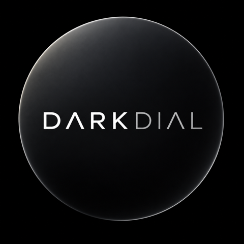</p>

# Darkdial

**A rotary controller for Adobe Lightroom Classic, with time tracking built in.**

Darkdial turns a small round touch display with a knob into a dedicated tool
for developing photos: pick a slider, turn, and watch the value ring follow.
In the Library the same knob goes through your photos and a tap rates them.
A long press switches to a stopwatch for your jobs, so the hours you spend
editing are recorded where you spend them. On a cable or over Bluetooth.

<p align="center">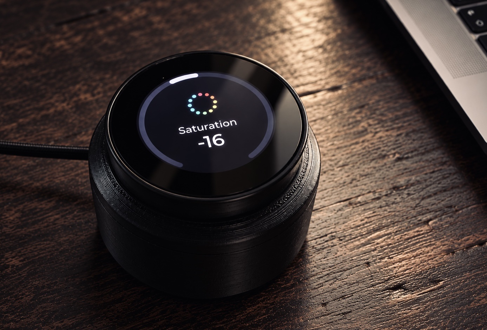</p>

**Easy to install:** all you need is the device and the app. The DMG
contains the firmware and puts it on the device with one click, and it
installs the Lightroom plug-in by itself.

**[Download the macOS app](https://github.com/MrNash23/DarkDial/releases/latest)** ·
[Website](https://mrnash23.github.io/DarkDial/) ·
[What you need](#what-you-need) · [Getting started](#getting-started) ·
[For developers](#for-developers)

Darkdial is free and open source. It is powered by
[meine-belichtungszeit.de](https://meine-belichtungszeit.de).

---

## What it does

### Develop with a knob

- **Turn** to move through your sliders: Exposure, Contrast, Highlights,
  Shadows, Temperature, and so on. Each has its own icon and a short name.
- **Tap** the display to select one, then **turn** to change it. Slow turns make small
  steps, a quick spin covers a lot of ground.
- The **ring** around the display shows the value: from the top to either side
  for sliders with a centre, from the start for the others. The number is
  always visible.
- The display **follows Lightroom**. Move a slider with the mouse, switch to
  another photo, apply a preset: the ring and the number update. Move one
  slider with the mouse and the device jumps to it, ready to continue with the
  knob (this can be switched off).
- **Double-tap** the display, or hold a finger on it, to reset the selected
  slider to its default.
- **Press** the knob to go to the Library, and there to come back to
  Develop.

<p align="center">
  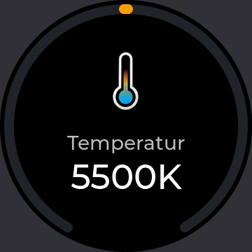
  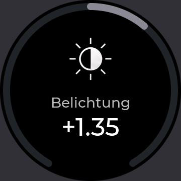
  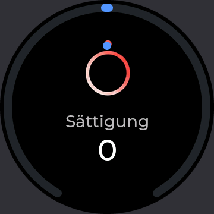
  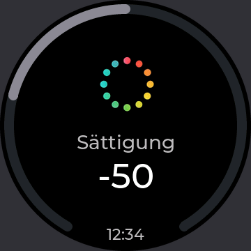
</p>

You choose which sliders are on the device, in which order, with which short
name, icon, step size and sensitivity, and what a fast turn does: bigger
steps automatically, no acceleration, or a fast step of its own (say 1 when
turning slowly, 10 when turning fast). 46 are available:

| Group | Sliders |
| --- | --- |
| White balance | Temperature, Tint |
| Tone | Exposure, Contrast, Highlights, Shadows, Whites, Blacks |
| Presence | Texture, Clarity, Dehaze, Vibrance, Saturation |
| Detail | Sharpening, Noise reduction |
| Effects | Vignette, Grain |
| Tone curve | Highlights, Lights, Darks, Shadows |
| Crop | Straighten angle |
| HSL | Hue, Saturation and Luminance for each of the eight colours |

The first thirteen are on by default. Short names come in German and English.

### Cull in the Library

- While Lightroom shows the Library, **turning** goes through the photos, one
  per click of the knob.
- The display shows the file name, the stars, the colour label and the flag
  of the photo.
- **Tap** and **double-tap** the display to mark it. What each of the two
  does is chosen in the app: flag as pick or rejected, one to five stars, a
  colour label, or nothing. Each can go on to the next photo by itself. The
  same action again takes the mark back.
- **Press** the knob to switch to Develop with the photo you are on.

<p align="center">
  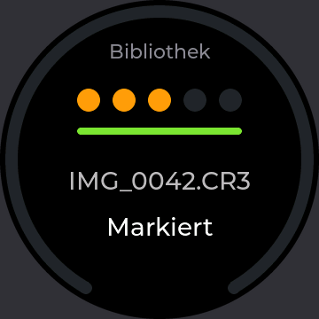
  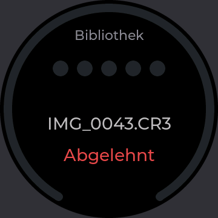
</p>

### Without a cable to the Mac

On a power supply or a power bank instead of the Mac's USB port, the device
connects over **Bluetooth**. The app finds it by itself; with the cable in the
Mac, USB has priority. The board has no battery, so it always needs power
over USB.

### Track your time per job

- **Hold the knob** for half a second to open time tracking. Choose a client,
  then one of its jobs or "New job", and the clock runs.
- Darkdial knows which **collection or folder** is open in Lightroom. Tie one
  to a job once, and that job is offered first whenever you work in it.
- The **running time** sits in the gap at the bottom of the ring while you
  keep editing, and next to the icon in the menu bar.
- Only one clock runs at a time. Starting another job stops the first at the
  same instant.

The desktop app keeps the books:

- an **overview** of hours per job for the week, the month or any period,
- **clients and jobs** with short names and colours,
- every **entry** with start, end and note, editable, and entries added by hand,
- an **archive**, a **search** over jobs, clients and notes,
- **CSV export** with exact durations, or rounded to minutes or quarter hours.

Nothing is lost if the app quits or the computer sleeps while a clock runs:
on the next start Darkdial asks whether the clock should keep running or stop
at the time it was last seen, and after sleep whether to deduct the pause.
It never stops a clock on its own.

<p align="center">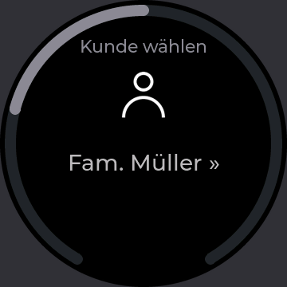</p>

---

## What you need

| | |
| --- | --- |
| **Hardware** | [Elecrow CrowPanel 1.46″ HMI ESP32 Rotary Display](https://www.elecrow.com/crowpanel-1-46inch-hmi-esp32-rotary-display-360-360-ips-round-touch-knob-screen.html) (ESP32-S3, 360×360 round IPS touch display, rotary knob with push, 8 RGB LEDs), connected by USB-C or Bluetooth |
| **Computer** | A Mac with macOS 13 or newer |
| **Software** | Adobe Lightroom Classic |

Windows is planned; the app, the plug-in and the firmware are built on
parts that run there, but it has not been built or tested yet.

---

## Getting started

### 1. Install the app

Download `Darkdial-<version>.dmg` from the
[latest release](https://github.com/MrNash23/DarkDial/releases/latest), open
it and drag Darkdial to Applications. The app is signed and notarised by
Apple, so it starts without warnings.

Darkdial lives in the menu bar; it has no Dock icon. On its first start it
opens a window and offers to **set up**: this installs the Lightroom plug-in
and lets Darkdial start when you log in. Restart Lightroom afterwards.

### 2. Update the device

The app brings the matching firmware. Connect the device to the Mac with a
USB cable, open the app's section **Device** and click **Update** under
"Firmware". This also works for a new board that still runs Elecrow's
firmware. The app restarts
the device into its bootloader, writes the firmware, checks it and restarts
it; this takes about 30 seconds. Settings and orientation are kept. The
section shows when the app has newer firmware than the device.

Without the app, the firmware can also be written with
[esptool](https://docs.espressif.com/projects/esptool/): download
`darkdial-firmware-<version>.zip` from the release and run

```sh
esptool.py --chip esp32s3 write_flash 0x0 darkdial-firmware-<version>.bin
```

If the board is not found, hold **BOOT**, press **RESET**, release **BOOT**,
and try again. This replaces the firmware the board ships with; Elecrow
publishes the original in its own repository if you ever want it back.

Developers can build and flash from source instead, see below.

### 3. Use it

Plug the device into the Mac, or into a power supply to use it over
Bluetooth (macOS asks once whether Darkdial may use Bluetooth). The
menu-bar icon shows a filled dot when both the device and Lightroom are
connected; the section **Device** says whether it is on USB or Bluetooth.

| On the device | Does |
| --- | --- |
| Turn | Move through the sliders; in edit mode, change the value |
| Tap the display | Select a slider, or leave it again |
| Double-tap, or touch and hold | Reset the selected slider to its default |
| Press | Switch Lightroom to the Library |
| Hold the knob for half a second | Open time tracking; hold again to close it |

| In the Library | Does |
| --- | --- |
| Turn | Next or previous photo |
| Tap, double-tap | Mark the photo as chosen in the app |
| Press | Switch Lightroom to Develop |

With the Library mode switched off in the app, or without Lightroom, the
press selects a slider like a tap.

Left alone for three minutes, the display shows the Darkdial logo. The next
turn, press or touch brings it back; that first input does nothing else.

If the device does not stand upright, for example to lead the cable away
neatly, the picture can be turned: in the app, section "Device" →
"Rotate …", then turn the knob until it is level and press it to save.

<p align="center">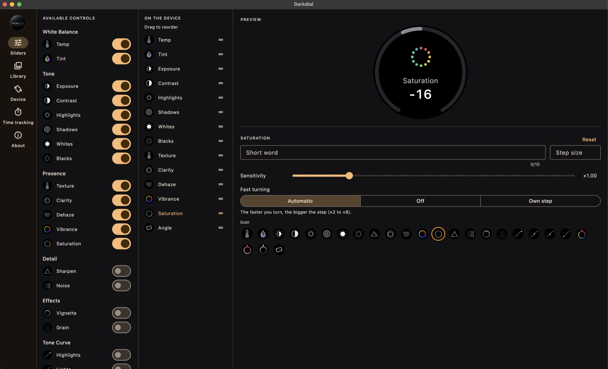</p>
<p align="center">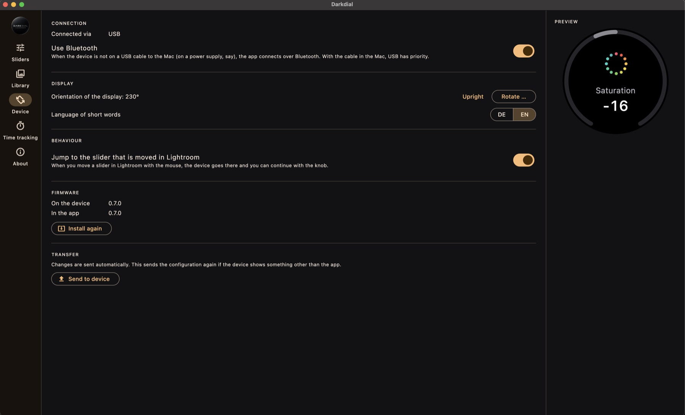</p>

Click the menu-bar icon and choose **Configure …** to pick your sliders
(section "Sliders"), what the taps do in the Library (section "Library") and
how the device itself behaves (section "Device"), or
**Time tracking …** for clients, jobs and hours. Clients are created in the
app; on the device you choose among them.

---

## How it works

```
Device  ⇄  USB-MIDI or BLE-MIDI  ⇄  Darkdial app  ⇄  localhost socket  ⇄  Lightroom plug-in
```

The device is a class-compliant USB-MIDI device and a standard BLE-MIDI
device; it needs no driver. The app
in the menu bar holds all the logic: which sliders exist, step sizes, units,
jobs and times. The Lightroom plug-in is a thin translator that reads and
sets Develop values. The device shows what it is told and reports what you
turn and press.

Darkdial talks only to its own plug-in and its own device. It does not use
or replace MIDI2LR, and both can be installed side by side.

The wire format of both links is specified in
[docs/PROTOCOL.md](docs/PROTOCOL.md).

---

## Status

Darkdial is young. It is in use on a few devices with macOS and Lightroom
Classic 15, and it has automated tests from the firmware core up to the app,
but expect rough edges:

- The icons of the time tracking menu are placeholders.
- Windows is not supported yet (app, firmware update and Bluetooth are
  prepared for it, but not built or tested there).
- Over Bluetooth the knob reacts a little later than over USB.
- The board has no battery: without a cable to the Mac it needs a power
  supply or a power bank.

Bug reports and ideas are welcome in the
[issues](https://github.com/MrNash23/DarkDial/issues).

---

## For developers

| Folder | What | Language |
| --- | --- | --- |
| `firmware/` | Device firmware: carousel, value ring, menu, Library, USB- and BLE-MIDI, encoder decoder | C++ (Arduino core 3.x, LVGL 9) |
| `plugin/` | Lightroom Classic plug-in | Lua |
| `app/` | Menu-bar app: configuration, time tracking, firmware update | Dart (Flutter) |
| `app/packages/darkdial_core/` | Protocol, engine, time tracking, ESP32 flasher; no Flutter | Dart |
| `protocol/` | `params.json`, the single source for all sliders | JSON |
| `tools/` | Generators, build and test scripts | Python, shell, Swift |
| `docs/` | Protocol, design documents (German), hardware bring-up | Markdown |

Everything can be built and tested without the device and without Lightroom:

```sh
tools/check.sh          # every automated check
```

The firmware's state machine is plain C++ and also runs on the host, where
the tests of the Dart engine drive it over the real wire format. The LVGL
screens are rendered headless into `firmware/host/snapshots/`. The encoder
decoder is tested against recordings of the real knob
(`firmware/host/fixtures/`).

| Task | Command |
| --- | --- |
| Run the app | `cd app && flutter run -d macos` |
| Try it without hardware | in a debug build (`flutter run`), switch on "Simulator" in the info section; the preview is the device (scroll = turn, click = tap, double click = double tap, right click = press the knob, long click = time tracking) |
| Try the real MIDI path without hardware | `swift tools/virtual_device.swift` creates a macOS MIDI device "Darkdial" backed by the firmware core |
| Try it without Lightroom | `cd app/packages/darkdial_core && dart run darkdial_core:fake_lr` |
| Install the plug-in for development | `tools/install_plugin.sh`, then reload it in Lightroom's Plug-in Manager |
| Talk to the plug-in directly | `tools/lr_cli.py status` (quit the app first; it holds the ports) |
| Build / flash the firmware | `tools/build_firmware.sh [port]` |
| Put the firmware into the app | `tools/bundle_firmware.sh` (done by the release script) |
| Flash through the app's own code | `cd app && dart run tool/flash.dart <merged.bin>` |
| Signed macOS release (DMG) | `tools/package_macos.sh`, with `NOTARY_PROFILE=<name>` also notarised |
| See the device screens | `firmware/host/build.sh`, images in `firmware/host/snapshots/` |
| Regenerate tables, icons, fonts | `tools/gen_params.py`, `tools/gen_icons.py`, `tools/gen_fonts.sh` |

You need Flutter 3.44 or newer, arduino-cli with the esp32 core 3.x and the
libraries lvgl 9.6, LovyanGFX and NimBLE-Arduino 2.x, Python 3 (`tools/.venv` with Pillow for the
icons), and LuaJIT for the plug-in tests. Notes from the first run on real
hardware are in [docs/BRINGUP.md](docs/BRINGUP.md).

---

## License

Darkdial is licensed under the
[GNU General Public License v3.0](LICENSE), with one additional term under its
section 7(b), see [ADDITIONAL-TERMS.md](ADDITIONAL-TERMS.md):

**The credit to [meine-belichtungszeit.de](https://meine-belichtungszeit.de)
must be kept** in every copy and modified version: in the logo on the device,
in the app's info section and in the Lightroom plug-in.

**The name "Darkdial", the Darkdial logo and the meine-Belichtungszeit logo
are not covered by the GPL.** You are welcome to fork and use the code under
the terms of the license, but forks may not be distributed under the name
Darkdial or with these logos as their own.

The firmware fonts are generated from Montserrat (SIL Open Font License 1.1).
The display driver derives from LovyanGFX (FreeBSD License).

Darkdial is not affiliated with or endorsed by Adobe. Adobe and Lightroom are
trademarks of Adobe Inc.
